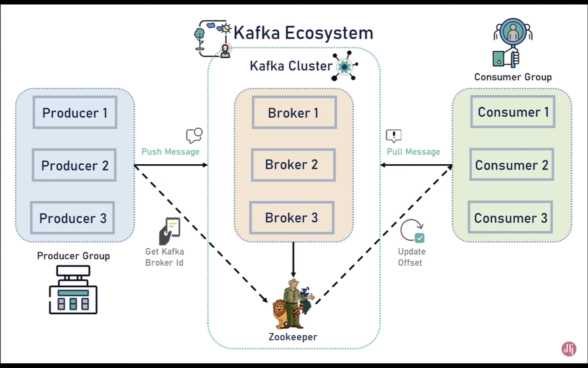

# kafka-playground
Basic Spring Boot + Kafka: this is a playground for my Kafka(Distributed System) learning. Using version 3.2.1

KAFKA Ecosystem:


- **Kafka Cluster**: Kafka cluster consists of a set of brokers. A cluster has a minimum of 3 broker.
- **Kafka Broker** : The broker is the Kafka Server:
  - The **Producer** and **Consumer** don't interact directly.
  - A place where microservices will exchange the messages.
- **Consumer**: Application that consume/read the message from Kafka server.
  - **Consumer Group**: Group of consumers working together to process the messages.
- **Producer**: Application that produce message (message such as SOAP, REST and etc). It send message to Kafka server.
- **Kafka Topic**: An identification mechanism to request data from broker. Topic is used by the consumer (subscribe to topic)
- **Kafka Partitions**: Kafka topics divided into a number of partitions, which contain records in an **unchangeable** sequence.
  - Partitions is being use due to the capacity of data in Topic is too large and not possible to store in single server. (distribute the topics)
  - **Offsets**: A sequence of ids given to message as the arrived at a partition.
- **Zookeeper**: Manage/Maintain state of all broker, topic, cluster and config
- **Broker**: if 1 broker goes down. other 2 can manage the entire cluster

<h2>Step to start the project</h2>

Stuff to download:
1. Open the [Kafka Quickstart](https://kafka.apache.org/quickstart) page and download the Kafka [here](https://www.apache.org/dyn/closer.cgi?path=/kafka/3.2.1/kafka_2.13-3.2.1.tgz).
   1. As of this project created. using Kafka 3.2.1
2. Springboot

Start Kafka Environment:
1. open terminal
2. cd /path/to/kafka_2.12-3.2.1
3. ```bin/zookeeper-server-start.sh config/zookeeper.properties```
4. open new terminal
5. ```bin/kafka-server-start.sh config/server.properties```
6. Kafka broker is running at localhost:9092


Credit to [Java Guides](https://www.youtube.com/c/JavaGuides) Youtube channel for providing courses.