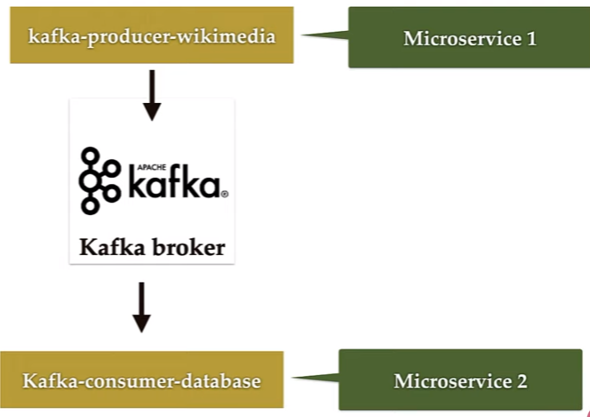

# kafka-playground

<p>
Basic Spring Boot + Kafka: this is a playground for my Kafka(Distributed System) learning. 
Using Kafka version 3.2.1
Using Java 11
Using Postgres as Database
</p>


This Repo consist of 2 project:
1. springboot-kafka-playground -> Tutorial and Basic of Kafka
2. springboot-kafka-wikimedia -> Real world application project

KAFKA Ecosystem:


- **Kafka Cluster**: Kafka cluster consists of a set of brokers. A cluster has a minimum of 3 broker.
- **Kafka Broker** : The broker is the Kafka Server:
  - The **Producer** and **Consumer** don't interact directly.
  - A place where microservices will exchange the messages.
- **Consumer**: Application that consume/read the message from Kafka server.
  - **Consumer Group**: Group of consumers working together to process the messages.
- **Producer**: Application that produce message (message such as SOAP, REST and etc). It send message to Kafka server.
- **Kafka Topic**: An identification mechanism to request data from broker. Topic is used by the consumer (subscribe to topic)
- **Kafka Partitions**: Kafka topics divided into a number of partitions, which contain records in an **unchangeable** sequence.
  - Partitions is being use due to the capacity of data in Topic is too large and not possible to store in single server. (distribute the topics)
  - **Offsets**: A sequence of ids given to message as the arrived at a partition.
- **Zookeeper**: Manage/Maintain state of all broker, topic, cluster and config
- **Broker**: if 1 broker goes down. other 2 can manage the entire cluster

<h1>Step to start the project (Tutorial-Playground)</h1>

Stuff to download:
1. Open the [Kafka Quickstart](https://kafka.apache.org/quickstart) page and download the Kafka [here](https://www.apache.org/dyn/closer.cgi?path=/kafka/3.2.1/kafka_2.13-3.2.1.tgz).
   1. As of this project created. using Kafka 3.2.1
2. [Spring Initializr Playground](https://start.spring.io/#!type=maven-project&language=java&platformVersion=2.7.2&packaging=jar&jvmVersion=11&groupId=com.dzakirinmd&artifactId=springboot-kafka-playground&name=springboot-kafka-playground&description=Demo%20project%20for%20Spring%20Boot%20and%20Kafka&packageName=com.dzakirinmd.springboot-kafka-playground&dependencies=web,kafka)

Start Kafka Environment:
1. open terminal to start Kafka Zookeeper:
2. cd /path/to/kafka_2.12-3.2.1
   1. For Window Powershell: ```.\bin\windows\zookeeper-server-start.bat .\config\zookeeper.properties```
   2. For Linux/Mac: ```bin/zookeeper-server-start.sh config/zookeeper.properties```
3. open new terminal to start Kafka server:
   1. For Window Powershell: ```.\bin\windows\kafka-server-start.bat .\config\server.properties```
   2. For Linux/Mac: ```bin/kafka-server-start.sh config/server.properties```
4. Kafka broker is running at localhost:9092
5. To delete Kafka Topic:
    1. for Linux/Mac: ```./bin/kafka-topics.sh --bootstrap-server localhost:9092 --delete --topic order-topics```
6. To read the message in topic:
   1. bin/kafka-console-consumer.sh --topic Topic1 --from-beginning --bootstrap-server localhost:9092
   2. For Window Powershell: ```.\bin\windows\kafka-console-consumer.bat --topic Topic1 --from-beginning --bootstrap-server localhost:9092```
   3. For Linux/Mac: ```bin/kafka-console-consumer.sh --topic Topic1 --from-beginning --bootstrap-server localhost:9092```
   4. available topics:
      1. quickstart-events
      2. Topic1
      3. Topic1-json
7. Running the application:
   1. in cmd, cd /path/to/pom.xml and run ```mvn clean package -DskipTests=true```
   2. make sure the kafka server and zookeeper is running, then cd /path/to/springboot-kafka-playground-0.0.1-SNAPSHOT.jar and run ```java -jar springboot-kafka-playground-0.0.1-SNAPSHOT.jar```

<h1>Wikimedia Stream-Real World project</h1>

<p>
Kafka Real world project: read huge amount of realtime stream data from Wikimedia to database.
it is a multi-model maven project.

Data Stream From: [wikimedia stream](https://stream.wikimedia.org/v2/stream/recentchange) 

Project Flow:
Wikimedia -> Kafka Producer -> Kafka Broker -> Kafka Consuer -> DB

Microservices: 
1. kafka-consumer-database
2. kafka-producer-wikimedia
3. wikimedia-recent-change


</p>

<h1>Step to start the project (Wikimedia Stream-Real World project)</h1>

1. [Spring Initializr Wikimedia](https://start.spring.io/#!type=maven-project&language=java&platformVersion=2.7.2&packaging=jar&jvmVersion=11&groupId=net.dzakirinmd&artifactId=springboot-kafka-real-world-project&name=springboot-kafka-real-world-project&description=Demo%20RealWorld%20project%20for%20Spring%20Boot%20and%20Kafka&packageName=net.dzakirinmd.springboot-kafka-real-world-project&dependencies=kafka,lombok)
2. Open this realworld project from different intellij to avoid confusion.


<h1>Documentation</h1>
- [Spring Kafka Documentation](https://docs.spring.io/spring-kafka/reference/html/#getting-started)

<h1>Credits</h1>
Credit to [Java Guides](https://www.youtube.com/c/JavaGuides) Youtube channel for providing courses.